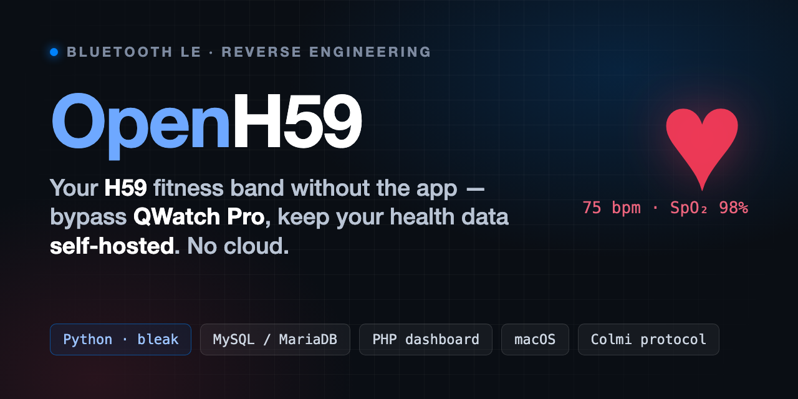

# OpenH59 — il tuo braccialetto H59 senza l'app



> **Reverse engineering del fitness tracker H59 (protocollo Colmi/QWatch Pro) via Bluetooth LE.** Niente cloud, niente account: i tuoi dati sanitari restano sul tuo computer.


Raccoglie e visualizza i dati del braccialetto **H59** (battito, SpO2, pressione, passi, stress, HRV) **bypassando l'app QWatch Pro**: parla direttamente con il device via **Bluetooth LE** (`bleak` / CoreBluetooth), salva tutto in un database **MySQL/MariaDB** locale e mostra i grafici in una **dashboard PHP** self-hosted.

> 🇬🇧 **English version below** — [jump to English](#openh59--english).

**Cosa fa:** smartwatch / fitness band economico (cloni Colmi, app QWatch Pro / QCWatch) → dati grezzi sotto il tuo controllo, senza inviare nulla a server di terze parti.

## Componenti
- `config.py` — legge la configurazione da `.env` (indirizzo braccialetto + DB).
- `band.py` — client BLE del braccialetto (misure real-time + download storico).
- `store.py` — database MySQL (tabelle: `measurements`, `hr_samples`, `step_samples`, `stress_samples`, `hrv_samples`).
- `collect.py` — collettore: scarica storico + misure on-demand → MySQL. Stampa un JSON di riepilogo.
- `setup.py` — setup una-tantum (ora + log battito 24/7).
- `index.php` — dashboard con grafici e bottoni di sincronizzazione.
- `start.command` — avvia la dashboard.

## Cosa si ottiene
- **Storico** (si riempie indossando il braccialetto): battito (5 min), passi/calorie/distanza (15 min), stress (30 min), HRV (30 min), **SpO2 (oraria, min-max)** e **sonno a fasi** (leggero/profondo/REM/sveglio).
- **On-demand** (misura del momento): battito, SpO2, pressione (sis/dia), stress.

## Requisiti
- **macOS** (il client BLE usa CoreBluetooth tramite `bleak`).
- **Python 3.11+**.
- **PHP 8+** (es. via [Laravel Herd](https://herd.laravel.com/) o `brew install php`).
- **MySQL/MariaDB** in ascolto su `127.0.0.1:3306` (Herd lo fornisce; altrimenti `brew install mariadb`).
- Un braccialetto **H59** (protocollo Colmi/QC, app QWatch Pro).

## Installazione (provalo tu)

> Il database e le tabelle vengono **creati automaticamente** al primo avvio: non serve SQL manuale.

1. **Clona il progetto** ed entra nella cartella:
   ```bash
   git clone <URL-del-repo> LudoHealt && cd LudoHealt
   ```
2. **Crea l'ambiente Python** e installa le dipendenze:
   ```bash
   python3 -m venv .venv
   .venv/bin/pip install -r requirements.txt
   ```
3. **Configura** copiando il template:
   ```bash
   cp .env.example .env
   ```
   Apri `.env` e compila `BAND_ADDRESS` e le credenziali del DB (i default vanno bene per MySQL locale senza password).
4. **Trova l'indirizzo del braccialetto** (`BAND_ADDRESS`). Indossa il braccialetto, spegni il Bluetooth del telefono, poi:
   ```bash
   .venv/bin/python -c "import asyncio; from bleak import BleakScanner; print('\n'.join(f'{d.address}  {d.name}' for d in asyncio.run(BleakScanner.discover())))"
   ```
   Copia l'indirizzo del dispositivo H59 dentro `BAND_ADDRESS` nel `.env`.
   *(Su macOS è uno UUID CoreBluetooth, non un MAC: è specifico del tuo Mac.)*
5. **Setup iniziale** del braccialetto (una volta sola — imposta l'ora e attiva il log battito 24/7):
   ```bash
   .venv/bin/python setup.py
   ```
   Alla prima esecuzione macOS chiederà il permesso **Bluetooth**: consenti.
6. **Avvia la dashboard**:
   ```bash
   bash start.command          # oppure:  php -S 127.0.0.1:8080
   ```
   Apri **http://127.0.0.1:8080**.

## Uso quotidiano
1. **Indossa il braccialetto** e **spegni il Bluetooth del telefono** (il braccialetto parla con un solo dispositivo per volta).
2. Avvia la dashboard (`bash start.command`) e apri http://127.0.0.1:8080.
3. Premi **Misura veloce** (~1 min) / **Misura completa** (~3 min, con pressione e stress) / **Solo storico** (~10 s).

### Dal cellulare
Mentre il Mac tiene aperta la dashboard, dal telefono (stessa rete Wi-Fi) apri
`http://<IP-del-Mac>:8080` per vedere i grafici. La misura dal braccialetto avviene sempre sul Mac.

## Struttura
- `docs/` — appunti tecnici, protocollo, guida snoop log, articolo del progetto.

## Note
- L'indirizzo BLE del braccialetto e le credenziali DB stanno nel `.env` (vedi `.env.example`).
- Timestamp salvati in UTC.
- SpO2 e sonno hanno storico sul dispositivo (canale BLE "ricco" `bc`, vedi `band.py`): li scarichiamo come gli altri.
- La **pressione** non ha uno storico reale sul dispositivo: la curva "oraria" mostrata dall'app ufficiale è generata lato app (valori quasi costanti). Da noi resta solo misura on-demand.

---

# OpenH59 — English

> **Reverse engineering the H59 fitness tracker (Colmi / QWatch Pro protocol) over Bluetooth LE.** No cloud, no account: your health data stays on your own machine.

Collect and visualize data from the **H59** fitness band — heart rate, SpO2, blood pressure, steps, stress, HRV — **bypassing the QWatch Pro app**. It talks to the device directly over **Bluetooth LE** (`bleak` / CoreBluetooth), stores everything in a local **MySQL/MariaDB** database, and shows the charts in a self-hosted **PHP dashboard**.

**What it does:** a cheap smartwatch / fitness band (Colmi clones, QWatch Pro / QCWatch app) → raw data under your control, with nothing sent to third-party servers.

## Components
- `config.py` — reads configuration from `.env` (band address + DB).
- `band.py` — band BLE client (real-time measurements + history download).
- `store.py` — MySQL database (tables: `measurements`, `hr_samples`, `step_samples`, `stress_samples`, `hrv_samples`).
- `collect.py` — collector: downloads history + on-demand measurements → MySQL. Prints a JSON summary.
- `setup.py` — one-time setup (clock + 24/7 heart-rate logging).
- `index.php` — dashboard with charts and sync buttons.
- `start.command` — starts the dashboard.

## What you get
- **History** (fills up while wearing the band): heart rate (5 min), steps/calories/distance (15 min), stress (30 min), HRV (30 min), **SpO2 (hourly, min-max)** and **staged sleep** (light/deep/REM/awake).
- **On-demand** (instant measurement): heart rate, SpO2, blood pressure (sys/dia), stress.

## Requirements
- **macOS** (the BLE client uses CoreBluetooth via `bleak`).
- **Python 3.11+**.
- **PHP 8+** (e.g. via [Laravel Herd](https://herd.laravel.com/) or `brew install php`).
- **MySQL/MariaDB** listening on `127.0.0.1:3306` (provided by Herd; otherwise `brew install mariadb`).
- An **H59** band (Colmi/QC protocol, QWatch Pro app).

## Installation (try it yourself)

> The database and tables are **created automatically** on first run — no manual SQL needed.

1. **Clone the project** and enter the folder:
   ```bash
   git clone <repo-URL> LudoHealt && cd LudoHealt
   ```
2. **Create the Python environment** and install dependencies:
   ```bash
   python3 -m venv .venv
   .venv/bin/pip install -r requirements.txt
   ```
3. **Configure** by copying the template:
   ```bash
   cp .env.example .env
   ```
   Open `.env` and fill in `BAND_ADDRESS` and the DB credentials (defaults are fine for a local passwordless MySQL).
4. **Find the band address** (`BAND_ADDRESS`). Wear the band, turn off your phone's Bluetooth, then:
   ```bash
   .venv/bin/python -c "import asyncio; from bleak import BleakScanner; print('\n'.join(f'{d.address}  {d.name}' for d in asyncio.run(BleakScanner.discover())))"
   ```
   Copy the H59 device's address into `BAND_ADDRESS` in `.env`.
   *(On macOS this is a CoreBluetooth UUID, not a MAC: it is specific to your Mac.)*
5. **Initial band setup** (once — sets the clock and enables 24/7 HR logging):
   ```bash
   .venv/bin/python setup.py
   ```
   On first run macOS will ask for **Bluetooth** permission: allow it.
6. **Start the dashboard**:
   ```bash
   bash start.command          # or:  php -S 127.0.0.1:8080
   ```
   Open **http://127.0.0.1:8080**.

## Daily use
1. **Wear the band** and **turn off your phone's Bluetooth** (the band talks to one device at a time).
2. Start the dashboard (`bash start.command`) and open http://127.0.0.1:8080.
3. Press **Quick measure** (~1 min) / **Full measure** (~3 min, with blood pressure and stress) / **History only** (~10 s).

### From your phone
While the Mac keeps the dashboard running, open `http://<Mac-IP>:8080` from your phone
(same Wi-Fi network) to view the charts. The actual band measurement always happens on the Mac.

## Layout
- `docs/` — technical notes, protocol, snoop-log guide, project write-up.

## Notes
- The band's BLE address and DB credentials live in `.env` (see `.env.example`).
- Timestamps are stored in UTC.
- SpO2 and sleep have on-device history (the "rich" BLE `bc` channel, see `band.py`): we download them like the rest.
- **Blood pressure** has no real on-device history: the "hourly" curve shown by the official app is generated app-side (near-constant values). On our side it stays on-demand only.

---

## Keywords

H59 smart band · H59 fitness tracker · H59 smartwatch · QWatch Pro alternative · QCWatch · Colmi protocol · reverse engineering · Bluetooth Low Energy (BLE) · `bleak` · CoreBluetooth · heart rate · SpO2 · blood pressure · stress · HRV · steps · self-hosted health data · no cloud · privacy · MySQL · MariaDB · PHP dashboard · Python · macOS · open source fitness band.

</content>
</invoke>
